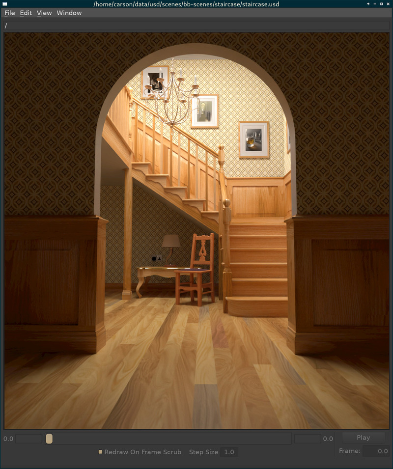
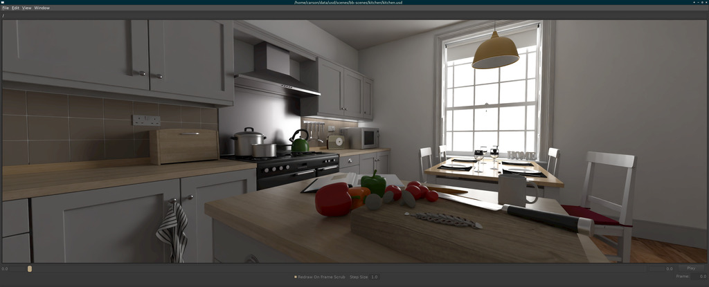
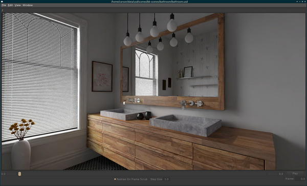
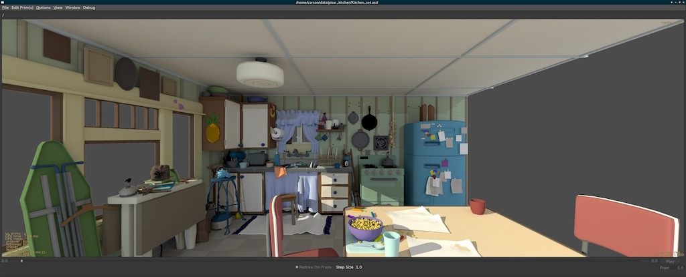
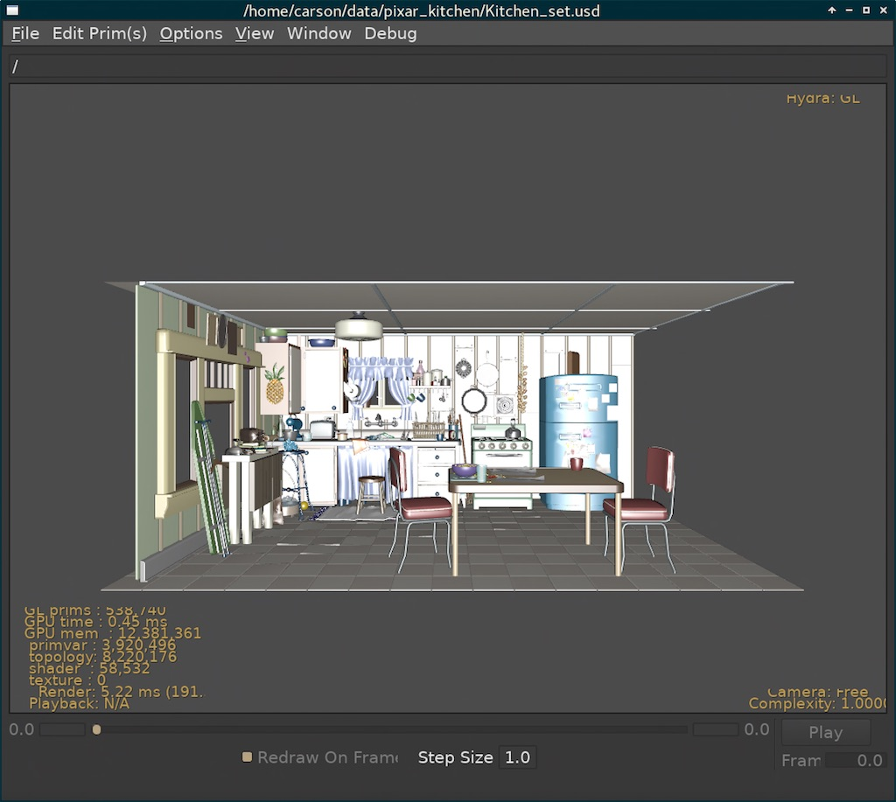
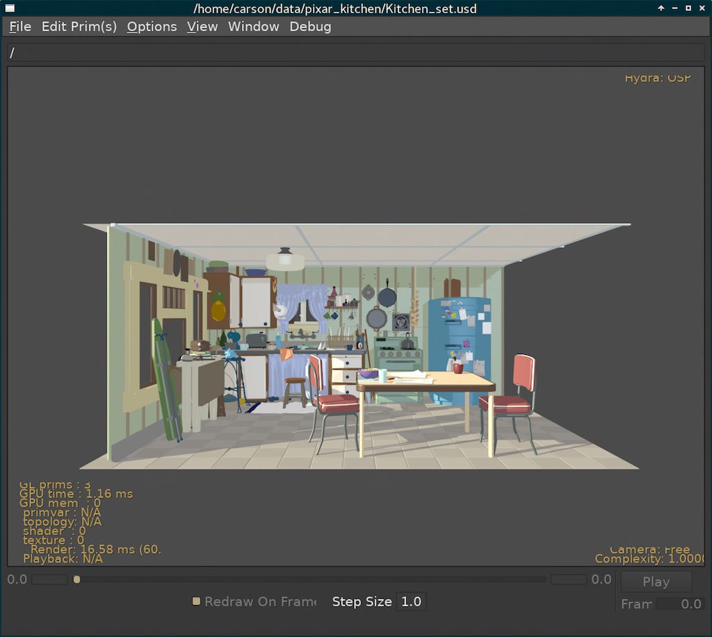
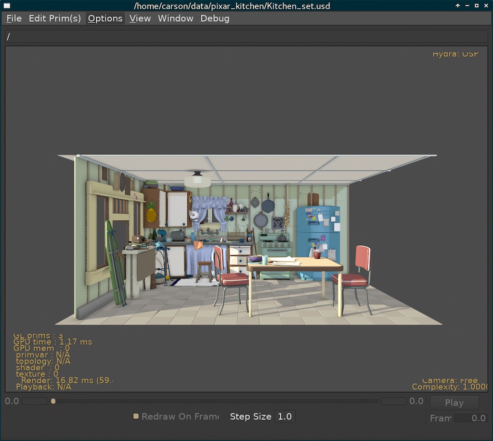
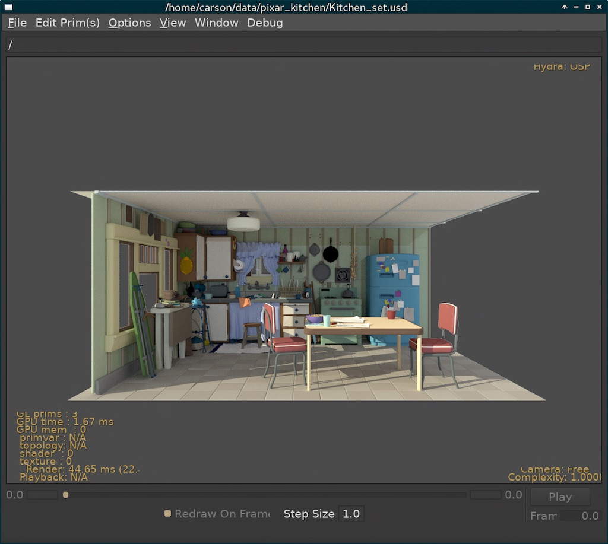
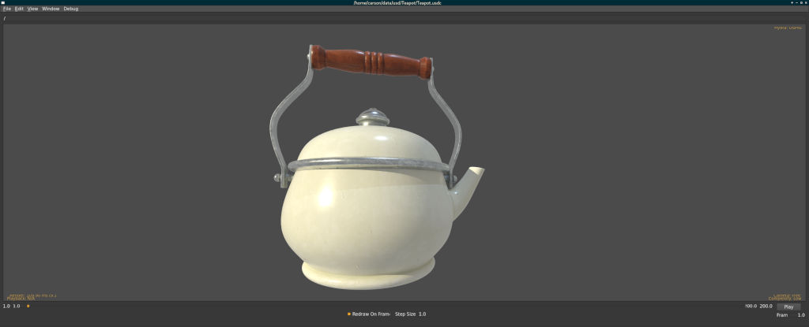
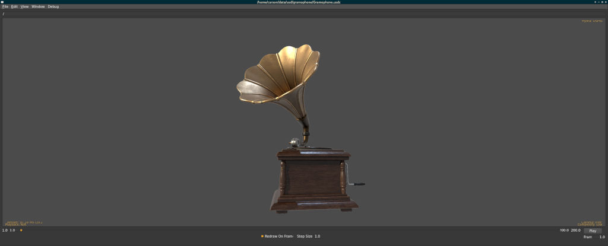

# OSPRay for Hydra (HdOSPRay)

OSPRay interactive rendering plugin for USD Hydra

Staircase model by Wig42
[CC](https://creativecommons.org/licenses/by/3.0/), modified by
[Bitterli](https://benedikt-bitterli.me/resources/), rendered in
usdview.

Visit [HdOSPRay on github](https://github.com/ospray/hdospray) for more
information.

## OSPRay for Hydra

OSPRay for Hydra (hdOSPRay) is an open source plugin for Pixar’s USD to
extend the Hydra rendering framework with [Intel®
OSPRay](https://www.ospray.org). HdOSPRay enables interactive, path
traced rendering by utilizing OSPRay’s renderers and [Intel® Open Image
Denoise](http://openimagedenoise.org). OSPRay for Hydra and OSPRay are
released under the permissive Apache 2.0 license.

As part of the [Intel oneAPI Rendering
Toolkit](https://software.intel.com/en-us/rendering-framework), OSPRay
is highly-optimized for Intel® CPU architectures ranging from laptops to
large-scale distributed HPC systems. HdOSPRay leverages the Intel®
Rendering Framework to deliver interactive rendering for large-scale
models at high levels of fidelity, as demonstrated at SIGGRAPH 2018
using over [100GB of production
assets](https://itpeernetwork.intel.com/intel-open-source-libraries-hollywood).

### Support and Contact

HdOSPRay is still in beta, with new features and existing issues being
worked on regularly. USD is also under active development and is often
fast changing. We tag the HdOSPRay releases to match specified USD
releases, but cannot always anticipate all of the changes and resulting
issues for users. Please report any issues you may run into to our
[issue tracker](https://github.com/ospray/hdospray/issues). We always
welcome suggestions and especially pull requests\!

## HdOSPRay Gallery

Our gallery currently contains a limited set of renderings done with
HdOSPRay inside of usdview using publicly available USD datasets. We
hope to grow this gallery as more assets become available. Please let us
know of any great scenes we may be missing, or if you would like to send
us a scene for testing and displaying here\!

Instructions are provided for loading some of the scenes below.  

### Country Kitchen

  
Converted scene by Jay-Artist
<a href="https://creativecommons.org/licenses/by/3.0/">CC</a>, modified
by [Bitterli](https://benedikt-bitterli.me/resources/).  

 

### Bathroom

   Converted
scene by Mareck
<a href="https://creativecommons.org/publicdomain/zero/1.0/">CC</a>,
modified by [Bitterli](https://benedikt-bitterli.me/resources/).

   

### Kitchen Set

  Pixar Kitchen Set path traced with HdOSPRay in usdview  

 

  - Download Kitchen Set asset from
    [Pixar](http://graphics.pixar.com/usd/downloads.html)

  - Run usdview using HdOSPRay using
    
        HDOSPRAY_USE_PATH_TRACING=1 usdview --renderer OSPRay Kitchen_set.usd
    
     

  Pixar Kitchen Set rendered with default GL in usdview  

 

  Pixar Kitchen Set rendered with HdOSPRay and basic shadows in
usdview  

 

  Pixar Kitchen Set rendered with HdOSPRay and basic ambient
occlusion in usdview  

 

  Pixar Kitchen Set rendered with HdOSPRay and path tracing in
usdview  

 

### Teapot

  Apple teapot rendered with HdOSPRay in usdview  

 

  - Download the Apple ARKit teapot from
    [Apple](https://developer.apple.com/arkit/gallery/models/teapot/teapot.usdz)

  - USDZ files are zip files, unzip using platform specific program of
    your choice
    
        unzip teapot.usdz

  - Run usdview using HdOSPRay using
    
        HDOSPRAY_USE_PATH_TRACING=1 usdview --renderer OSPRay Teapot.usdc
    
     

### Gramophone

  Apple Gramophone rendered with HdOSPRay in usdview  

 

  - Download the Apple ARKit gramophone from
    [Apple](https://developer.apple.com/arkit/gallery/models/gramophone/gramophone.usdz)

  - USDZ files are zip files, unzip using platform specific program of
    your choice
    
        unzip teapot.usdz

  - Run usdview using HdOSPRay using
    
        HDOSPRAY_USE_PATH_TRACING=1 usdview --renderer OSPRay Gramophone.usdc
    
     

# Building OSPRay for Hydra

OSPRay for Hydra source is available on GitHub at
[HdOSPRay](http://github.com/ospray/hdospray). The master branch is
typically the most stable branch and contains tagged releases.

Tags are of the form `hdospray-vx.x.x-usdvx.x.x`, with `vx.x.x` being
the release of HdOSPRay and `usdv` being the version of USD it is built
against. This is required due to the frequently changing internals of
hydra.

Currently HdOSPRay is regularly tested on Linux Arch. MacOS support in
USD is experimental, but we often test against it. Windows support of
USD is also experimental, but we have not tested HdOSPRay with it.

## Prerequisites

If using the superbuild, the only dependencies are: - c/c++ compiler
(gcc 6.3.1+) - cmake 3.1.1+ - python (3.7.x+ recommended), with
PySide/PySide2 and PyOpenGL. ‘pip install PySide2 PyOpenGL’ may work

If you are building standalone, you will need: - [USD
v20.08](https://graphics.pixar.com/usd/docs/index.html) - USD is
primarily tested with Linux, but has experimental support for MacOS and
Windows. For a full list of USD dependencies, see the USD page. -
[OSPRay 2.9.0](http://www.ospray.org/) - We recommend using ospray’s
superbuild to build dependencies such as embree, ospcommon, and openvkl.
OpenImageDenoise can also be enabled through superbuild. -
[OpenImageIO 1.8.17](https://sites.google.com/site/openimageio/home)

## Optional Dependencies

  - Houdini SDK (tested against 18.5). To use, enable
    SUPERBUILD\_USE\_HOUDINI in superbuild.
  - [OpenImageDenoise](https://github.com/OpenImageDenoise/oidn.git)
      - Open Image Denoise needs be be enabled in the OSPRay build.

## Superbuild on Linux/MacOS

HdOSPRay contains a cmake superbuild script that builds external
dependencies for you and is the recommended way of building hdospray. By
default, this will also build usdview.

    mkdir build
    cd build
    cmake -DCMAKE_INSTALL_PREFIX=<install_dir> ../scripts/superbuild/ (or use ccmake to specify option through gui)
    cmake --build . -j <numthreads>

By default, all install files will be installed into
<build dir>/install. A setup script can then be called to set paths:

    source <install_dir>/setup_hdospray.sh
    usdview <usdfile> --renderer OSPRay

## Manual Compiling USD on Linux/MacOS

To build USD, see the [USD GitHub
site](https://github.com/PixarAnimationStudios/USD). We recommend
following the build scripts provided, for which we provide an example
invocation below.  
If you wish to use usdview, you must also enable imaging and python.  
The options and compilers used can vary from our example, but make sure
that TBB use is consistent across your build of USD, hdOSPRay, and
OSPRay. The command we use for building USD is:

    python <USD_SOURCE>/build_scripts/build_usd.py --python --usd-imaging --openimageio <USD_BUILD_DIR>

To set TBB explicitly, go to `<USD_BUILD_DIR>`/build/USD and set TBB
libraries and include directories using cmake.

## Compiling OSPRay on Linux/MacOS

You can use the distributed binaries of OSPRay or build it yourself. We
recommend using the OSPRay superbuild system according the instructions
listed on [github](https://github.com/ospray/OSPRay). Make sure that TBB
is the same used by USD. You can force using system TBB using the
superbuild by going to `<OSPRAY_BUILD_DIR>`, and setting the cmake
variable `DOWNLOAD_TBB` to OFF.

## Compiling HdOSPRay on Linux/MacOS

HdOSPRay plugin uses a CMake build system which links in USD and builds
externally from the USD source directory, but configures CMake as if it
were inside the USD repository in order to build the plugin using USD
internals. It must therefore be built against a version of USD that
matches HdOSPRay, which is specified in the versioning tag of HdOSPRay.

  - Download/clone the git repo for HdOSPRay
    
        $ git clone https://github.com/ospray/hdospray.git

  - Create a build directory and call CMake
    
        $ cd hdospray
        $ mkdir build
        $ cd build
        $ ccmake ..

  - Set `CMAKE_INSTALL_PREFIX` to the installation directory of USD.

  - Set `pxr_DIR` to the install directory of USD which contains
    `pxrConfig.cmake`

  - Set `ospray_DIR` to the directory containing your
    `osprayConfig.cmake`
    
      - This can be found in the root directory of the distributed
        binaries or if you are building and installing from source it
        can be found in `<install>/lib/cmake/ospray-\*/`

  - Set `openvkl_DIR` to install directory of OpenVKL. These will be the
    same as `ospray_DIR` if you downloaded the OSPRay binaries, or in
    OSPRay’s superbuild directory under
    install/openvkl/lib/cmake/openvkl\*.

  - Set `rkcommon_DIR` to install directory of rkCommon. These will be
    the same as `ospray_DIR` if you downloaded the OSPRay binaries, or
    in OSPRay’s superbuild directory under
    install/rkcommon/lib/cmake/rkcommon\*.

  - Set `embree_DIR` to install directory of Embree. These will be the
    same as `ospray_DIR` if you downloaded the OSPRay binaries, or in
    OSPRay’s superbuild directory under
    install/embree/lib/cmake/embree\*.

  - Compile and install HdOSPRay
    
        $ make -j install

The plugin should now be in `<usd install
directory>/plugin/usd/hdOSPRay`

## Compiling HdOSPRay on Windows

Windows support of USD is experimental. We have not tested HdOSPRay with
it, so use at your own risk.

# Documentation

## Running

Once built, the plugin code should be located in your `usd` install
directory under `plugin/usd/HdOSPRay`. Run `usdview <scenefile>` and
select `view->Hydra` and then `Renderer->OSPRay`.

OSPRay can be set to the default renderer by either

  - Setting the `HD_DEFAULT_RENDERER` environment variable
    
        $ export HD_DEFAULT_RENDERER=OSPRay

  - Specifying `--renderer OSPRay` as a command line argument to usdview

### Environment variables

Most of these options are also exposed through the usdview GUI under
Hydra Settings.

  - `HDOSPRAY_SAMPLES_PER_FRAME`
    
    Number of samples per pixel.

  - `HDOSPRAY_SAMPLES_TO_CONVERGENCE`
    
    Will progressively render frames until this many samples per pixel,
    then stop rendering.

  - `HDOSPRAY_LIGTH_SAMPLES`

Number of light samples at every path intersection. A value of -1 leads
to sampling all light sources in the scene. *Does not affect scivis
renderer.*

  - `HDOSPRAY_AMBIENT_OCCLUSION_SAMPLES`
    
    Number of ambient occlusion samples to compute per pixel. *Does not
    affect path tracer.*

  - `HDOSPRAY_CAMERA_LIGHT_INTENSITY`
    
    Globally modify the intensity of all lights.

  - `HDOSPRAY_USE_PATH_TRACING`
    
    Use Monte Carlo path tracer instead of faster Whitted-style
    renderer.

  - `HDOSPRAY_MAX_PATH_DEPTH`
    
    Maximum ray depth. Will affect the number of diffuse bounces as well
    as transparency.

  - `HDOSPRAY_USE_SIMPLE_MATERIAL`
    
    Use a simple diffuse + phone material instead of principled
    material.

  - `HDOSPRAY_INIT_ARGS`
    
    Specify arguments sent on to OSPRay for initialization. e.g. enable
    MPI.

  - `HDOSPRAY_PIXELFILTER_TYPE`
    
    The type of pixel filter used by OSPRay: 0 (point), 1 (box), 2
    (gauss), 3 (mitchell), and 4 (blackmanHarris).

  - `HDOSPRAY_FORCE_QUADRANGULATE`
    
    Force Quadrangulate meshes for debug.

  - `HDOSPRAY_USE_DENOISER`
    
    If built in, enable the denoiser

## Features

  - Denoising using [Open Image Denoise](http://openimagedenoise.org)
  - Distributed multi-node rendering over MPI
  - UVTextures
  - Pixel Filters
  - usdLux lights: disk, distant, dome, quad, sphere.
  - Triangle meshes
  - Quad meshes
  - Subdivision surfaces
  - Ray traced shadows and ambient occlusion.
  - Path tracing
  - Physically-based materials
  - Principled shader (similar to Disney BSDF shader)

# News, Updates, and Announcements

  - Feb 15, 2022: Version v0.9
    
        - Adding depth AOV
        - Adding normals AOV
        - Additional material parameters
        - Fixing generic texcoord naming
        - Update to OSPRay 2.9
        - Adding cylinder light
        - Adding camera depth of field
        - Minimal support for geomsubset materials
        - Ptex support currently deprecated in OSPRay.  Will be re-enabled upon OSPRay module_ptex release.

  - August 24, 2021: Version v0.8
    
        - Update to USD 20.08.
        - Houdini support.
        - Color buffer AOV support.
        - Superbuild script added.
        - Added camera light visibility flags.
        - Add thin materials.

  - May 28, 2021: Version v0.7
    
        - Update to OSPRay 2.6.0
        - Ptex support re-enabled.
        - Numerous light and material updates. Added disk lights.
        - Toggle for light enabled vs visible.
        - Animation update fixes.
        - Support for curves.

  - October 12, 2020: Version v0.6
    
        - Update to OSPRay 2.4.0
        - Added support for opacity textures.
        - Added adaptive view port scaling. The viewport is
          now scaled to reach a given interactive framerate (e.g., 10fps).
        - Fixed some bigs with animated shapes (e.g., ARKit data sets).
        - Added support to toggle the visibility of light sources and shapes.

  - July 31, 2020: Version v0.5
    
      - Update to OSPRay 2.2.0.
      - Added UsdLux light support.
      - Asynchronous rendering.
      - Dynamic resolution for greater interaction.
      - Pixel Filters.
      - Subdivision surfaces interpolation mode fixes.

  - June 15, 2020: Version v0.4
    
      - Update to OSPRay 2.1.0.
      - Update to USD 20.05.

  - September 15, 2019: Version v0.3
    
      - Subdivision surfaces support.
      - GUI options for usdview.
      - Various bug fixes.

  - April 30, 2019: Version v0.2.2
    
      - Various bug fixes.
      - OSPRay version updated to 1.8.5.
      - CMake targets.
      - Added animation support.

  - Mar 7, 2019: Version v0.2.1
    
      - Bug fixes.
      - Ptex updates.
      - Documentation.

  - Feb 28, 2019: Version v0.2.0
    
      - Initial Beta release version 0.2.0 is now available on the
        [HdOSPRay GitHub
        page](https://github.com/ospray/hdospray/releases/v0.2.0). This
        replaces the previous repository and versioning which was on my
        personal github account.
